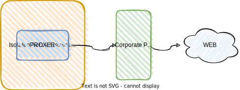

# Proxer

**Proxer** is a simple Go server which works as a "proxy wrapper".  
It forwards any request to a proxy using `http_proxy` and `https_proxy` environment variable.  



### Why?
Its main purpose is to serve as a workaround for environments and distributions which ignore or do not support `*_proxy` environment variables.  
In some corporations, any request must be forwarded through a proxy to access the internet, and in the previous cases entire microservices and containers end up being isolated from the web.  
For example, [nginx ignores such environment variables](https://trac.nginx.org/nginx/ticket/1399#ticket), which prevents nginx-based api gateways (such as [kong](https://github.com/Kong/kong)) to talk outside of the local server.  

### Run locally

Install this module
```
go install github.com/fenix-hub/proxer
```  

Configure the following environment variables
```
HTTP_PROXY=http://<user>:<password>@<ip>:<port>
HTTPS_PROXY=https://<user>:<password>@<ip>:<port>
```  

and run `${GOPATH}/proxer`.  
  
It will be running on `localhost:8080` by default.  

### Run with Docker
Create an `.env` file in the root of this project accordingly
```
PROXER_PORT=<your port>		# default to 8080
HTTP_PROXY=http://<user>:<password>@<ip>:<port>
HTTPS_PROXY=https://<user>:<password>@<ip>:<port>
```  

and run `docker compose up -d`.
  
It will be running on `localhost:<your port>` by default.  

## Usage

To define the target host, use `X-ProxyTo-Schema` and `X-ProxyTo-Host`.  
Any other HTTP request Method, Headers, Path, Body will be forwarded untouched.  
```bash
curl http://localhost:8080/get \
  -H 'X-ProxyTo-Schema: http' \
  -H 'X-ProxyTo-Host: httpbin.org'
```
will result in the (curl) equivalent:
```bash
curl --proxy-user <user>:<password> --proxy <http/https_proxy> -X <METHOD> -D <BODY> -H <HEADERS> http://httpbin.org/get
```
